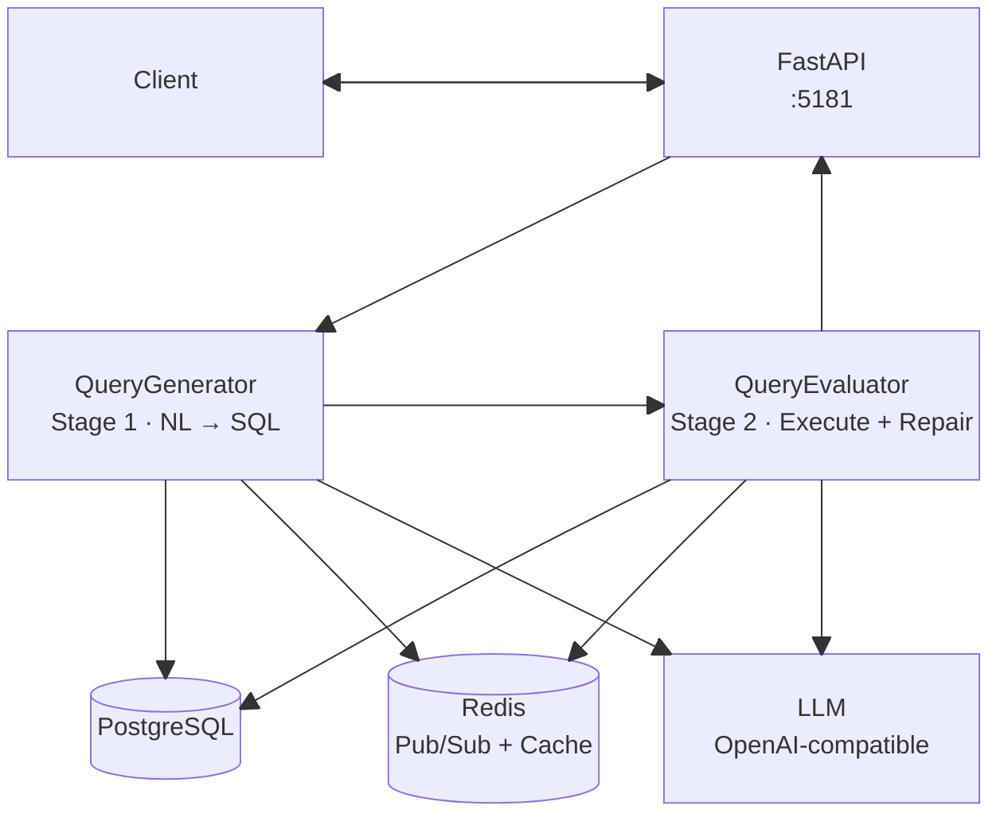
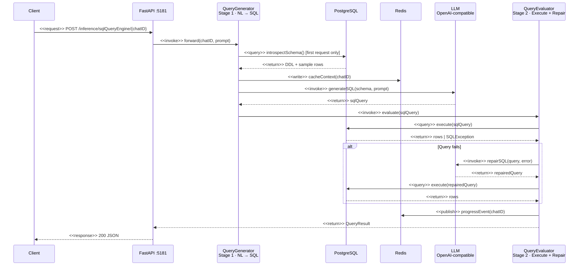

# SQL Query Engine

A self-hosted service that turns natural language questions into validated, executed PostgreSQL queries — powered by any OpenAI-compatible LLM.

Point it at a PostgreSQL database and an LLM endpoint. Ask questions in plain English. Get back SQL results.

## Introduction

SQL Query Engine is a two-stage inference pipeline:

1. **Generation** — Introspects the database schema, builds context once per session (cached in Redis), and asks the LLM to produce a SQL query from your natural language prompt.
2. **Evaluation** — Executes the generated SQL against PostgreSQL. If it fails or returns empty results, an LLM repair loop automatically fixes the query and retries up to `retryCount` times.

Every step streams real-time progress events over Redis Pub/Sub. The engine also exposes an OpenAI-compatible `/v1/chat/completions` endpoint, so it works out of the box with OpenWebUI or any OpenAI client.

## System Architecture

### Component Overview



### Interaction Flow



## Repository Layout

```
sqlqueryengine/
├── sqlQueryEngine/         ← Core inference package (see sqlQueryEngine/README.md)
├── evaluation/             ← Ablation study & benchmark harness (see evaluation/README.md)
├── docker-compose.yml      ← Production stack (engine + Redis + OpenWebUI)
├── docker-compose-evaluation.yml ← Evaluation stack (engine + Redis + PostgreSQL + runner)
├── Dockerfile              ← Multi-stage build (engine image + evaluation runner image)
├── run.py                  ← Uvicorn launcher
├── curlCommands.sh         ← Curl command reference for every endpoint
└── requirements.txt        ← Python dependencies
```

## Quick Start

**1. Clone the repository**

```bash
git clone https://github.com/codeadeel/sqlqueryengine.git
cd sqlqueryengine
```

**2. Configure `docker-compose.yml`**

Edit the environment block under the `sql-query-engine` service with your values:

```yaml
# LLM endpoint — Ollama, vLLM, OpenAI, LiteLLM, etc.
- LLM_BASE_URL=http://host.docker.internal:11434/v1
- LLM_MODEL=qwen2.5-coder:7b
- LLM_API_KEY=ollama

# Your PostgreSQL instance
- POSTGRES_HOST=host.docker.internal
- POSTGRES_PORT=5432
- POSTGRES_DB=mydb
- POSTGRES_USER=myuser
- POSTGRES_PASSWORD=mypassword
```

**3. Start the stack**

```bash
docker compose up --build
```

This starts the SQL Query Engine, Redis, and OpenWebUI (optional chat interface).

| Service | URL |
|---|---|
| SQL Query Engine API | `http://localhost:5181` |
| Swagger UI | `http://localhost:5181/docs` |
| OpenWebUI | `http://localhost:5182` |

## Environment Variables

| Variable | Default | Description |
|---|---|---|
| `LLM_BASE_URL` | `http://localhost:11434/v1` | OpenAI-compatible LLM endpoint |
| `LLM_MODEL` | `qwen2.5-coder:7b` | Model name |
| `LLM_API_KEY` | `ollama` | API key for the LLM service |
| `LLM_TEMPERATURE` | `0.1` | Sampling temperature |
| `POSTGRES_HOST` | `localhost` | PostgreSQL host |
| `POSTGRES_PORT` | `5432` | PostgreSQL port |
| `POSTGRES_DB` | | Database name |
| `POSTGRES_USER` | | Database user |
| `POSTGRES_PASSWORD` | | Database password |
| `REDIS_HOST` | `localhost` | Redis host |
| `REDIS_PORT` | `6379` | Redis port |
| `REDIS_PASSWORD` | | Redis password |
| `REDIS_DB` | `0` | Redis database number |
| `SERVER_HOST` | `0.0.0.0` | API bind address |
| `SERVER_PORT` | `8080` | API listen port |
| `SERVER_WORKERS` | `1` | Uvicorn worker count |
| `BOT_NAME` | `SQLBot` | Display name used in LLM prompts |
| `OPENAI_API_KEY` | | Bearer token(s) for `/v1/` routes — comma-separate multiple keys; leave empty to disable auth |
| `COMPLETIONS_MODEL_NAME` | `SQLBot` | Model name exposed via `/v1/models` |
| `DEFAULT_RETRY_COUNT` | `5` | Default max LLM repair attempts |
| `DEFAULT_SCHEMA_EXAMPLES` | `5` | Default sample rows per table sent to the LLM |
| `DEFAULT_FEEDBACK_EXAMPLES` | `3` | Default result rows fed back during repair |

## Usage

### Run inference

`chatID` is any string identifier for the session. It namespaces cached context in Redis — reuse the same ID to skip schema re-introspection on subsequent requests.

```bash
curl -X POST http://localhost:5181/inference/sqlQueryEngine/user1 \
  -H "Content-Type: application/json" \
  -d '{
    "basePrompt": "How many orders were placed in the last 30 days?"
  }'
```

**Response**

```json
{
  "code": 200,
  "status": "[ user1 | SQL Query Engine ]: Inference executed successfully.",
  "chatID": "user1",
  "agentResponse": {
    "generation": {
      "queryDescription": "Counts orders placed within the last 30 days.",
      "sqlQuery": "SELECT COUNT(*) FROM orders WHERE created_at >= NOW() - INTERVAL '30 days'"
    },
    "evaluation": {
      "currentQuery": "SELECT COUNT(*) FROM orders WHERE created_at >= NOW() - INTERVAL '30 days'",
      "currentObservation": "Query executed successfully and returned 1 row.",
      "results": [{ "count": "142" }]
    }
  },
  "extraPayload": null
}
```

### Health check

```bash
curl http://localhost:5181/ping
```

## Evaluation

The repository includes a self-contained evaluation harness that measures the self-healing loop's impact on query accuracy. It seeds three PostgreSQL databases (e-commerce, university, hospital) with synthetic data, runs 75 gold-annotated questions across three configurations (generation-only, single-shot, full pipeline), and produces ablation tables.

```bash
docker compose -f docker-compose-evaluation.yml up --build
```

Results are written to `evaluation/results/`. See [`evaluation/README.md`](evaluation/README.md) for the full methodology, module reference, and benchmark results across five LLM backends.

## Further Reading

| Document | What it covers |
|---|---|
| [`sqlQueryEngine/README.md`](sqlQueryEngine/README.md) | Internal architecture, every module, class/method reference, streaming protocol, Pub/Sub format |
| [`evaluation/README.md`](evaluation/README.md) | Evaluation methodology, question bank, scoring logic, multi-model benchmark results |
| [`curlCommands.sh`](curlCommands.sh) | Copy-paste curl examples for every endpoint |
| [Wiki](https://github.com/codeadeel/sqlqueryengine/wiki) | Additional guides and usage notes |
