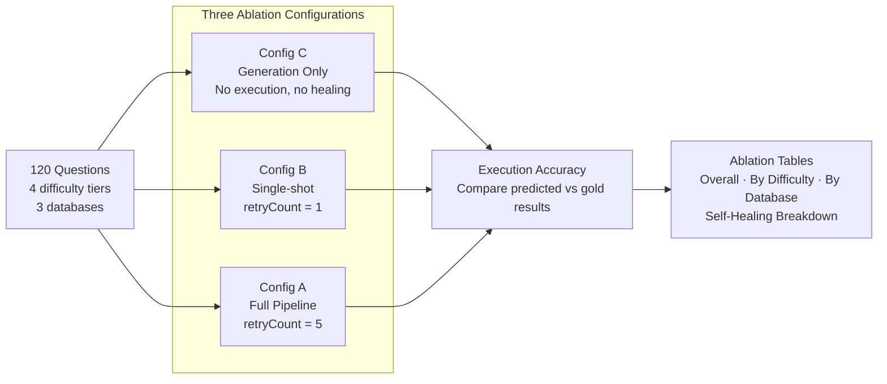
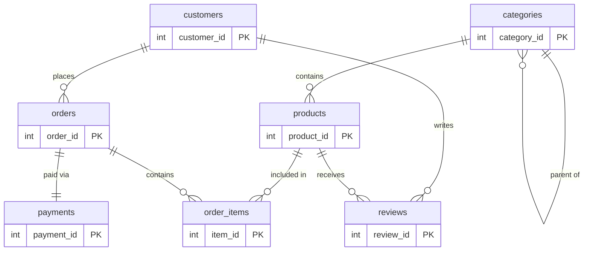
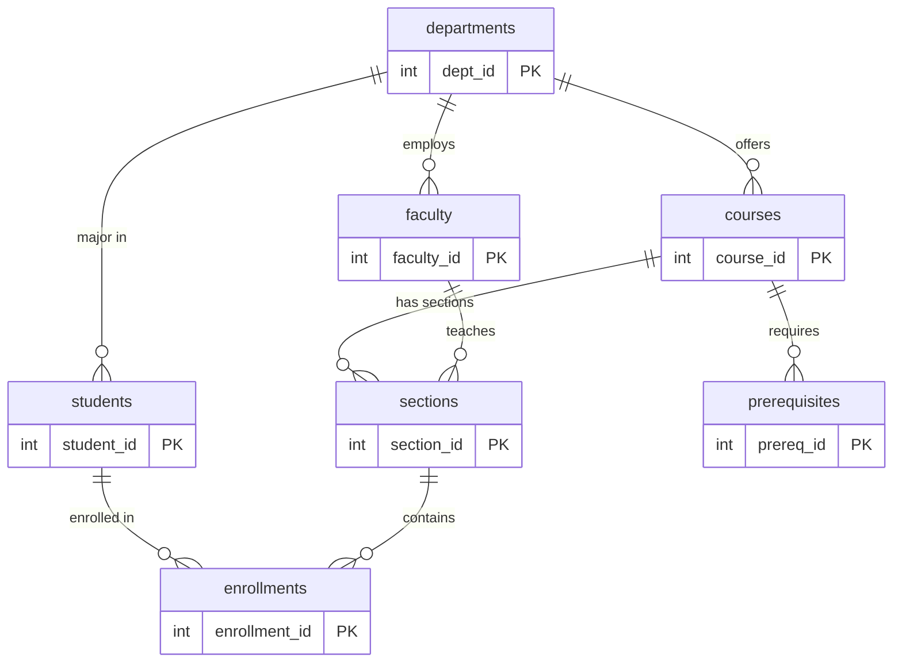
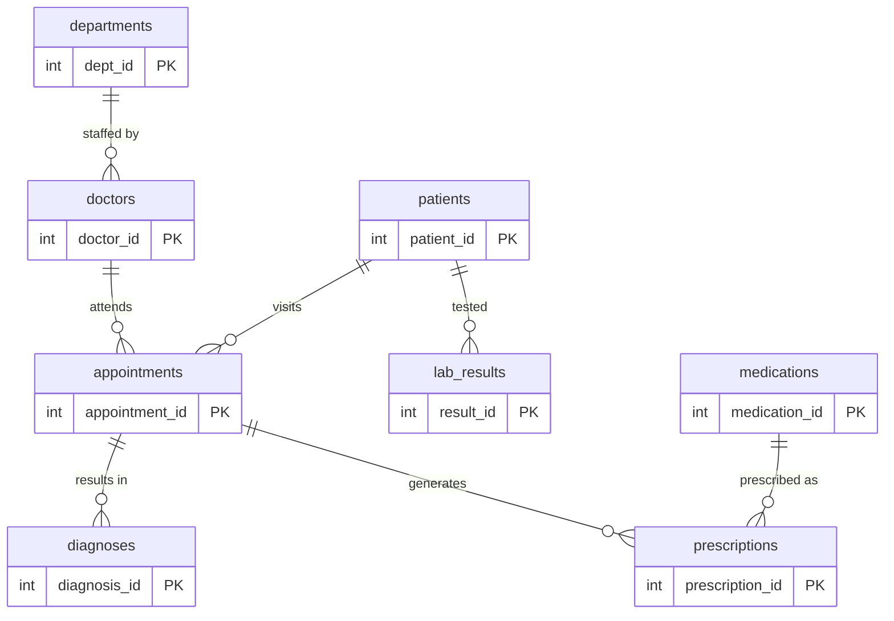
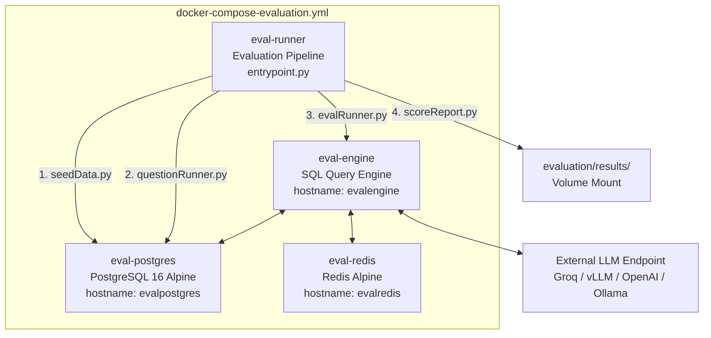
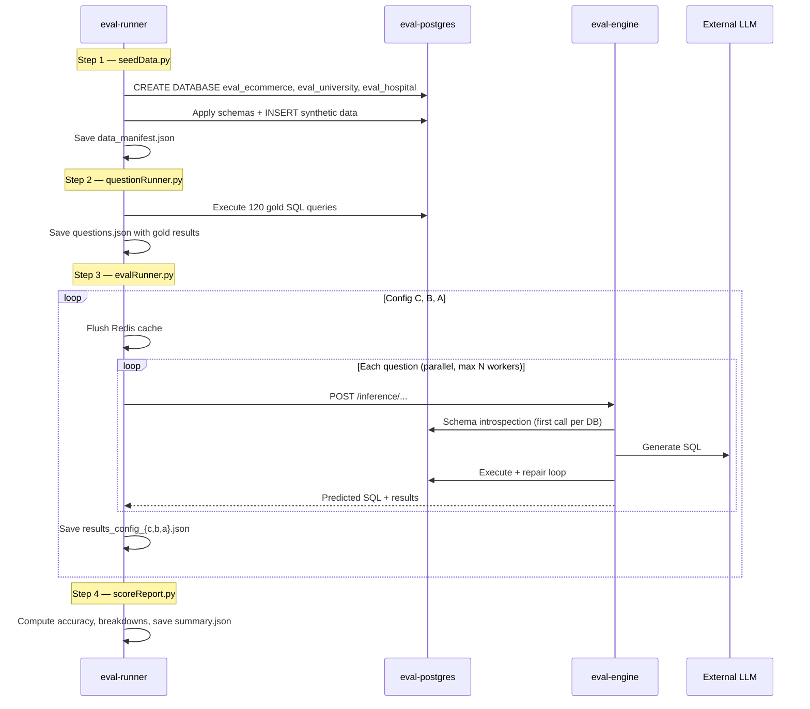
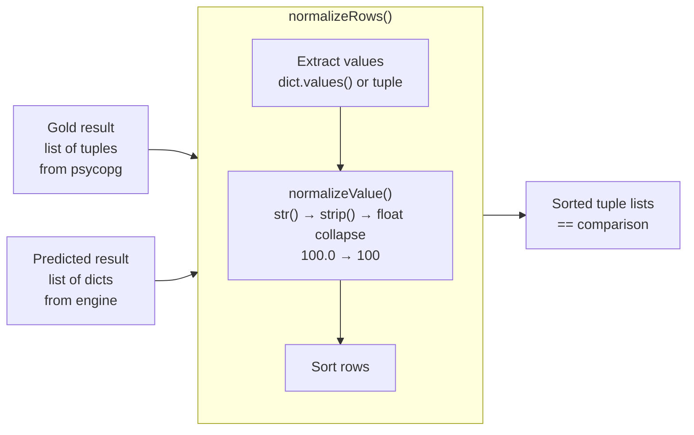

# `evaluation` — Ablation Study & Benchmark Harness

This directory contains a self-contained evaluation pipeline that measures the impact of the SQL Query Engine's self-healing loop on query accuracy. It seeds three PostgreSQL databases with synthetic data, runs 120 gold-annotated natural language questions (75 in the default Docker configuration) across three ablation configurations, and produces structured results with per-difficulty and per-database breakdowns.

## Table of Contents

1. [What This Evaluates](#1-what-this-evaluates)
2. [Module Map](#2-module-map)
3. [Evaluation Methodology](#3-evaluation-methodology)
4. [Databases and Schemas](#4-databases-and-schemas)
5. [Question Bank](#5-question-bank)
6. [Pipeline Architecture](#6-pipeline-architecture)
7. [Result Comparison Logic](#7-result-comparison-logic)
8. [Scoring and Reporting](#8-scoring-and-reporting)
9. [Running the Evaluation](#9-running-the-evaluation)
10. [Configuration Reference](#10-configuration-reference)
11. [Results Directory Structure](#11-results-directory-structure)
12. [Benchmark Results](#12-benchmark-results)

## 1. What This Evaluates

The central claim of SQL Query Engine is that its self-healing loop — where PostgreSQL diagnostics (SQLSTATE codes, hints, tracebacks) are fed back to the LLM for iterative repair — improves query accuracy over raw single-shot generation. This evaluation pipeline quantifies that claim by running three configurations against the same question set and comparing the results.



The delta between Config A and Config C is the headline result — it directly measures how many initially-failing queries the self-healing loop recovers.

## 2. Module Map

```
evaluation/
├── entrypoint.py           ← Orchestrates the full pipeline (seed → questions → eval → score)
├── evalConfig.py           ← Environment-driven configuration + connection helpers
├── schemaDefinitions.py    ← Inline DDL for the three evaluation databases
├── seedData.py             ← Creates databases, applies schemas, populates with Faker data
├── questionRunner.py       ← Executes all gold queries and writes questions.json
├── evalRunner.py           ← Runs the 3-config ablation study via engine REST API
├── resultComparator.py     ← Order-independent result set comparison (gold vs predicted)
├── scoreReport.py          ← Computes metrics, prints tables, writes summary.json
├── requirements.txt        ← Python dependencies for the evaluation runner
├── questions/              ← Question bank package
│   ├── __init__.py         ← Registry, subset selector, QUESTIONS_PER_DB config
│   ├── ecommerce.py        ← 40 questions for eval_ecommerce
│   ├── university.py       ← 40 questions for eval_university
│   └── hospital.py         ← 40 questions for eval_hospital
└── results/                ← Output directory
    └── runs/               ← Archived benchmark results (one folder per model)
        ├── qwen3-32b/
        ├── llama-3.3-70b/
        ├── llama-4-scout-17b/
        ├── gpt-oss-20b/
        └── gpt-oss-120b/
            ├── data_manifest.json      ← Row counts per table per database (verifies seeding)
            ├── questions.json          ← All questions with gold queries and gold results
            ├── results_config_a.json   ← Per-question results for Config A (retryCount=5)
            ├── results_config_b.json   ← Per-question results for Config B (retryCount=1)
            ├── results_config_c.json   ← Per-question results for Config C (generation only)
            └── summary.json            ← Aggregated metrics: accuracy, latency, healing breakdown
```

## 3. Evaluation Methodology

### Metric: Execution Accuracy (EX)

For each question, the evaluation:
1. Executes the **gold SQL** against PostgreSQL to get the expected result set.
2. Sends the **natural language question** to the SQL Query Engine.
3. Captures the **predicted SQL** and its result set from the engine.
4. Compares the two result sets (order-independent, type-normalized).

A prediction is **correct** if and only if the normalized, sorted result sets are identical.

### Three Ablation Configurations

| Config | Method | What it measures |
|---|---|---|
| **C** | `engine.generate()` + raw `psycopg` execution | Baseline: raw LLM SQL generation quality, no healing |
| **B** | `engine.run(retryCount=1)` | Single evaluation pass — one chance to fix |
| **A** | `engine.run(retryCount=5)` | Full self-healing loop — up to 5 repair iterations |

Config C calls the generation-only endpoint (Stage 1), then executes the returned SQL directly against PostgreSQL. No evaluation stage, no repair loop. This isolates the raw quality of the LLM's SQL generation.

Config B and A call the full inference endpoint with different retry limits. The self-healing loop captures PostgreSQL errors and feeds them back to the LLM for correction.

### Self-Healing Breakdown

The most important metric compares Config C against Config A question-by-question:

| Category | Definition |
|---|---|
| **Correct on 1st attempt** | Correct in both Config C and Config A |
| **Fixed by healing** | Incorrect in Config C, correct in Config A |
| **Exhausted retries** | Incorrect in both Config C and Config A |
| **Regressions** | Correct in Config C, incorrect in Config A |
| **Errors / timeouts** | Engine error or HTTP timeout |

"Fixed by healing" is the headline number — it counts queries that were wrong on the first LLM generation but recovered by the self-healing loop.

## 4. Databases and Schemas

Three PostgreSQL databases are created and seeded with deterministic synthetic data (`random.seed(42)`, `Faker.seed(42)`) to ensure reproducibility.

### `eval_ecommerce`

An e-commerce platform with customers, products, orders, reviews, and payments.



| Table | Rows | Key columns |
|---|---|---|
| `customers` | 100 | first_name, last_name, email, city, country, signup_date, is_premium |
| `categories` | 20 | name, parent_category_id (self-referential) |
| `products` | 200 | name, category_id, price, stock_quantity, is_active |
| `orders` | 500 | customer_id, order_date, status, total_amount |
| `order_items` | ~1,780 | order_id, product_id, quantity, unit_price |
| `reviews` | 300 | product_id, customer_id, rating (1-5), review_text |
| `payments` | 500 | order_id, payment_method, amount, status |

### `eval_university`

A university system with departments, faculty, students, courses, and enrollments.



| Table | Rows | Key columns |
|---|---|---|
| `departments` | 5 | name, building, budget |
| `faculty` | 20 | first_name, last_name, dept_id, title, salary |
| `students` | 200 | first_name, last_name, major_dept_id, enrollment_year, gpa |
| `courses` | 30 | course_code, title, dept_id, credits |
| `sections` | 50 | course_id, faculty_id, semester, year, room, schedule |
| `enrollments` | 800 | student_id, section_id, grade |
| `prerequisites` | 7 | course_id, required_course_id |

### `eval_hospital`

A hospital management system with patients, doctors, appointments, prescriptions, and lab results.



| Table | Rows | Key columns |
|---|---|---|
| `departments` | 5 | name, floor, phone |
| `doctors` | 15 | first_name, last_name, specialization, license_number |
| `patients` | 300 | first_name, last_name, date_of_birth, gender, insurance_provider |
| `appointments` | 1,000 | patient_id, doctor_id, appointment_date, status, reason |
| `diagnoses` | 600 | appointment_id, icd_code, description, severity |
| `medications` | 30 | name, category, unit_cost |
| `prescriptions` | 800 | appointment_id, medication_id, dosage, duration_days |
| `lab_results` | 500 | patient_id, test_name, result_value, unit, reference_range, is_abnormal |

## 5. Question Bank

120 questions total (40 per database), distributed across four difficulty tiers:

| Tier | Per DB | Total | Description |
|---|---|---|---|
| **Easy** | 10 | 30 | Single table, simple aggregation or filter |
| **Medium** | 12 | 36 | JOINs, GROUP BY, HAVING, basic subqueries |
| **Hard** | 10 | 30 | Multi-join, nested subqueries, window functions, CTEs |
| **Extra Hard** | 8 | 24 | Complex analytical — multiple CTEs, correlated subqueries, percentile calculations |

Each question is defined as a Python dict with `difficulty`, `question` (natural language), and `gold_query` (valid PostgreSQL). The `questionRunner.py` module executes every gold query against the seeded databases and writes `questions.json` with the gold result sets included.

The `QUESTIONS_PER_DB` environment variable (default: `40`) controls how many questions per database are included. When set below 40, a balanced subset is selected across difficulty tiers.

## 6. Pipeline Architecture

The evaluation runs as a Docker Compose stack defined in `docker-compose-evaluation.yml`:



### Execution Sequence



### Parallel Execution with Schema Warm-up

The evaluation runner uses a two-phase execution strategy per configuration:

1. **Phase 1 — Warm-up**: Runs the first question per database sequentially. This triggers schema introspection and caching in Redis, so subsequent questions skip the expensive LLM schema description step.
2. **Phase 2 — Parallel**: Dispatches remaining questions to a thread pool (`EVAL_MAX_WORKERS`, default 6). Each question reuses the cached schema context via the shared `chatID` per database.

Results are saved incrementally after each completed question, so partial results survive if the pipeline is interrupted.

### Rate Limit Handling

The `_postWithRetry` helper in `evalRunner.py` detects 429 responses from the LLM provider (either HTTP status or error message content) and retries with exponential backoff (5s, 10s, 15s, up to 5 attempts).

## 7. Result Comparison Logic

**File:** `resultComparator.py`

The engine returns results as `list[dict]` (column names as keys), while gold queries return `list[tuple]` (positional values). The comparator normalizes both formats:



Key design decisions:

- **Type normalization**: Values are compared as strings after float-collapsing (`100.0` and `100` are treated as equal).
- **Order independence**: Rows are sorted before comparison, so `ORDER BY` differences between gold and predicted SQL do not cause false negatives.
- **Dict/tuple interop**: Both `list[dict]` and `list[tuple]` are accepted transparently.

## 8. Scoring and Reporting

**File:** `scoreReport.py`

After all three configurations complete, the scoring module loads the result files and produces four tables:

| Table | Content |
|---|---|
| **Table 1** | Overall execution accuracy per configuration |
| **Table 2** | Accuracy broken down by difficulty tier (easy / medium / hard / extra_hard) |
| **Table 3** | Accuracy broken down by database domain, with Config A – Config C delta |
| **Table 4** | Self-healing breakdown (correct on 1st attempt / fixed by healing / exhausted / regressions) |

All metrics are also written to `summary.json` for programmatic consumption.

## 9. Running the Evaluation

### With Docker Compose (recommended)

1. Set your LLM credentials in `docker-compose-evaluation.yml` under the `eval-engine` service:

```yaml
- LLM_BASE_URL=https://api.groq.com/openai/v1   # or your vLLM/Ollama/OpenAI endpoint
- LLM_MODEL=meta-llama/llama-4-scout-17b-16e-instruct
- LLM_API_KEY=your-api-key-here
```

2. Optionally adjust the `eval-runner` environment:

```yaml
- QUESTIONS_PER_DB=25       # 25 balanced questions per DB (default 40 = all 120)
- EVAL_MAX_WORKERS=3        # parallel threads (tune for LLM throughput)
- TIMEOUT_SECONDS=180       # per-question timeout
```

3. Run:

```bash
docker compose -f docker-compose-evaluation.yml up --build
```

The runner container executes the full pipeline (seed → questions → evaluation → scoring), writes results to `evaluation/results/`, and exits. The other containers remain running until you stop them.

4. View results:

```bash
cat evaluation/results/summary.json | python3 -m json.tool
```

### Running Against a Different Model

To evaluate a new LLM, change `LLM_BASE_URL`, `LLM_MODEL`, and `LLM_API_KEY` in the compose file and re-run. Archive previous results first:

```bash
mkdir -p evaluation/results/runs/my-model
cp evaluation/results/*.json evaluation/results/runs/my-model/
docker compose -f docker-compose-evaluation.yml up --build eval-runner
```

## 10. Configuration Reference

All configuration is driven by environment variables, set in `docker-compose-evaluation.yml`.

### eval-runner environment

| Variable | Default | Description |
|---|---|---|
| `POSTGRES_HOST` | `evalpostgres` | PostgreSQL hostname (direct connection for seeding and gold queries) |
| `POSTGRES_PORT` | `5432` | PostgreSQL port |
| `POSTGRES_USER` | `evaluser` | PostgreSQL user |
| `POSTGRES_PASSWORD` | `evalpass` | PostgreSQL password |
| `ENGINE_URL` | `http://evalengine:8080` | SQL Query Engine base URL |
| `ENGINE_PG_HOST` | `evalpostgres` | PostgreSQL host as seen by the engine (passed as query param) |
| `ENGINE_PG_PORT` | `5432` | PostgreSQL port as seen by the engine |
| `REDIS_HOST` | `evalredis` | Redis hostname (for cache flushing between configs) |
| `REDIS_PORT` | `6379` | Redis port |
| `REDIS_PASSWORD` | `evalPass` | Redis password |
| `RESULTS_DIR` | `results` | Output directory for JSON result files |
| `QUESTIONS_PATH` | `results/questions.json` | Path to the generated questions file |
| `QUESTIONS_PER_DB` | `40` | Number of questions per database (set < 40 for a balanced subset) |
| `TIMEOUT_SECONDS` | `180` | HTTP timeout per question (seconds) |
| `EVAL_MAX_WORKERS` | `6` | Maximum parallel threads for evaluation |
| `LLM_MODEL` | `unknown` | Model name (written to summary.json for record-keeping) |
| `LLM_TEMPERATURE` | `0.1` | Temperature (written to summary.json) |

### eval-engine environment

Same as the main SQL Query Engine environment variables documented in the root README. Key additions for evaluation:

| Variable | Typical value | Purpose |
|---|---|---|
| `LLM_BASE_URL` | `https://api.groq.com/openai/v1` | LLM endpoint under test |
| `LLM_MODEL` | Model identifier | Model being evaluated |
| `LLM_API_KEY` | API key | Authentication for the LLM provider |
| `POSTGRES_DB` | `eval_ecommerce` | Default DB (overridden per-request by the runner) |

## 11. Results Directory Structure

After a complete run, the pipeline writes the following files to `results/`. Archive them to `results/runs/<model-name>/` before starting a new run (see [Running Against a Different Model](#running-against-a-different-model) above). The repository ships with archived benchmark results for five models under `results/runs/`.

| File | Content |
|---|---|
| `data_manifest.json` | Row counts per table per database — verifies seeding worked |
| `questions.json` | All questions with `id`, `database`, `difficulty`, `question`, `gold_query`, `gold_result` |
| `results_config_c.json` | Per-question results for Config C (generation only) |
| `results_config_b.json` | Per-question results for Config B (retryCount=1) |
| `results_config_a.json` | Per-question results for Config A (retryCount=5) |
| `summary.json` | Aggregated metrics: accuracy, latency, by_difficulty, by_database, healing_breakdown |

### Per-question result format

```json
{
  "id": 1,
  "database": "eval_ecommerce",
  "difficulty": "easy",
  "question": "How many customers are there?",
  "gold_query": "SELECT COUNT(*) FROM customers;",
  "predicted_sql": "SELECT COUNT(*) FROM customers",
  "match": true,
  "error": null,
  "latency_s": 2.3,
  "config": "A"
}
```

## 12. Benchmark Results

Results from five LLM backends, all evaluated on the same 75-question subset (25 per database, balanced across difficulty tiers). Temperature fixed at 0.1 for all runs.

### Overall Execution Accuracy

| Model | Config C | Config B | Config A | Healing Delta (A−C) |
|---|---|---|---|---|
| Llama 4 Scout 17B | 48.0% | 48.0% | **58.7%** | **+10.7 pp** |
| Llama 3.3 70B | 52.0% | 52.0% | 54.7% | +2.7 pp |
| GPT-OSS 120B | 50.7% | 46.7% | 49.3% | −1.4 pp |
| GPT-OSS 20B | 48.0% | 46.7% | 50.7% | +2.7 pp |
| Qwen3 32B | 40.0% | 26.7% | 46.7% | +6.7 pp |

### Self-Healing Breakdown

| Model | Correct 1st Attempt | Fixed by Healing | Exhausted Retries | Regressions |
|---|---|---|---|---|
| Llama 4 Scout 17B | 36 | **8** | 31 | 0 |
| Llama 3.3 70B | 39 | 2 | 34 | 0 |
| GPT-OSS 120B | 33 | 4 | 33 | 5 |
| GPT-OSS 20B | 33 | 5 | 34 | 3 |
| Qwen3 32B | 22 | **13** | 32 | 8 |

### Key Observations

Llama 4 Scout 17B shows the strongest self-healing performance: 8 queries fixed with zero regressions, yielding the highest overall accuracy (58.7%) and the largest healing delta (+10.7 pp). This suggests that models with strong instruction-following and structured output capabilities benefit most from the diagnostic feedback loop.

Qwen3 32B has the highest number of healed queries (13) but also the most regressions (8), indicating that its repair attempts sometimes overcorrect or introduce new errors. The net benefit is still positive (+6.7 pp).

Llama 3.3 70B and GPT-OSS 20B show modest but consistent improvements (+2.7 pp each) with low regression counts, suggesting stable healing behavior.

The healing loop provides the most value on medium and hard difficulty questions, where schema mismatches, incorrect JOINs, and type cast errors are most common. Easy questions are typically correct on the first attempt across all configurations.
