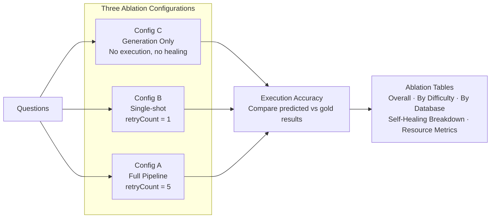

# SQL Query Engine — Evaluation Suite

Two independent evaluation pipelines for benchmarking the SQL Query Engine's NL-to-SQL accuracy and self-healing effectiveness.

## Directory Structure

```
evaluation/
  shared/                       Shared utilities used by both pipelines
    resultComparator.py           Order-independent result set comparison
    resourceMetrics.py            Latency percentiles, memory, throughput tracking

  synthetic/                    Synthetic evaluation (controlled environment)
    README.md                     Full documentation
    evalConfig.py                 Environment-driven configuration
    entrypoint.py                 Pipeline orchestrator
    seedData.py                   Database creation + Faker data seeding
    schemaDefinitions.py          DDL for 3 domains (ecommerce, university, hospital)
    questionRunner.py             Gold query executor
    evalRunner.py                 3-config ablation runner
    scoreReport.py                Metrics + report generation
    questions/                    120 gold NL-to-SQL questions (40 per domain)
    results/runs/                 Output (per-model results)
    requirements.txt              Python dependencies

  bird/                         BIRD benchmark evaluation (real-world databases)
    README.md                     Full documentation (dataset download, setup, running)
    birdConfig.py                 Environment-driven configuration
    birdEntrypoint.py             Pipeline orchestrator
    birdDataLoader.py             Dataset loading + SQLite dialect conversion
    sqliteToPostgres.py           SQLite to PostgreSQL database migration
    birdEvalRunner.py             3-config ablation runner
    birdScoreReport.py            Metrics + report generation + BIRD submission format
    bird_data/                    BIRD dataset (gitignored, downloaded separately)
    bird_results/runs/            Output (per-model results)
    requirements.txt              Python dependencies
```

## Pipelines at a Glance

| | Synthetic | BIRD |
|---|---|---|
| **Purpose** | Controlled reproducibility testing | Real-world benchmark comparison |
| **Questions** | 120 (40 per domain) | 500 (mini-dev) or 1,534 (full) |
| **Databases** | 3 (seeded at runtime) | 11 (mini-dev) or 95 (full) |
| **Database Engine** | PostgreSQL (native) | SQLite (converted to PostgreSQL) |
| **Difficulty Tiers** | easy, medium, hard, extra_hard | simple, moderate, challenging |
| **Compose File** | `docker-compose-synthetic-evaluation.yml` | `docker-compose-bird-evaluation.yml` |
| **Dockerfile** | `Dockerfile` (evaluationrunner stage) | `Dockerfile` (birdevaluationrunner stage) |
| **Runtime** | ~30-60 min | ~2-4 hours |

## Evaluation Methodology

Both pipelines use the same 3-configuration ablation study:



- **Config C (Generation Only)** — LLM generates SQL, executed raw against PostgreSQL. Measures baseline NL-to-SQL accuracy.
- **Config B (Single-Shot)** — Full engine pipeline with `retryCount=1`. Tests the evaluator without iterative healing.
- **Config A (Full Pipeline)** — Full engine pipeline with `retryCount=5`. Tests the complete self-healing loop.

The **self-healing delta** (Config A accuracy minus Config C accuracy) is the primary metric demonstrating the engine's iterative SQL repair capability.

## Reported Metrics

### Accuracy Metrics
- **Execution Accuracy (EX)** — order-independent comparison of gold vs predicted result sets
- **Accuracy by difficulty tier** — performance breakdown across question complexity levels
- **Accuracy by database domain** — per-domain performance comparison
- **Self-healing breakdown** — correct first attempt, fixed by healing, exhausted retries, regressions

### Resource Metrics (NEW)
- **Wall-clock time** — total elapsed time per configuration
- **Throughput** — questions evaluated per minute (q/min)
- **Peak memory** — peak RSS of the evaluation runner process (MB)
- **Latency percentiles** — min, p50, p90, p95, p99, max per-question response latency

Resource metrics are saved to `metrics_config_{c,b,a}.json` alongside the result files and included in `summary.json`.

## Running Evaluations

### Synthetic
```bash
docker compose -f docker-compose-synthetic-evaluation.yml up --build
```
See [`synthetic/README.md`](synthetic/README.md) for details.

### BIRD
```bash
# Download dataset first — see bird/README.md for instructions
docker compose -f docker-compose-bird-evaluation.yml up --build
```
See [`bird/README.md`](bird/README.md) for dataset download and setup.

## Switching Models

Both pipelines derive the results subfolder from `LLM_MODEL`. To evaluate a new model:

1. Change `LLM_MODEL` in both the engine and runner services in the relevant compose file
2. Run `docker compose up --build`
3. Results appear in `results/runs/{model_slug}/` automatically

Previous model results are preserved — each model gets its own subfolder.

## Benchmark Results (Synthetic — 75 questions)

| Model | Config C | Config B | Config A | Delta (A−C) | Healed | Regressions |
|---|---|---|---|---|---|---|
| **Llama 4 Scout 17B** | 48.0% | 50.7% | **57.3%** | **+9.3 pp** | 7 | 0 |
| GPT-OSS 20B | 45.3% | 45.3% | 53.3% | +8.0 pp | 6 | 0 |
| Llama 3.3 70B | 53.3% | 54.7% | 54.7% | +1.4 pp | 3 | 2 |
| GPT-OSS 120B | 50.7% | 49.3% | 48.0% | -2.7 pp | 2 | 4 |
| Qwen3 32B | 48.0% | 42.7% | 46.7% | -1.3 pp | 5 | 6 |

## Benchmark Results (BIRD mini-dev — 437 evaluated questions)

| Model | Config C | Config B | Config A | Delta (A−C) | Healed | Regressions |
|---|---|---|---|---|---|---|
| **GPT-OSS 120B** | 44.4% | 42.6% | **49.0%** | **+4.6 pp** | 39 | 19 |
| Llama 4 Scout 17B | 37.1% | 34.3% | 40.5% | +3.4 pp | 35 | 20 |
| Llama 3.3 70B | 43.7% | 38.0% | 46.5% | +2.8 pp | 35 | 23 |
| GPT-OSS 20B | 43.5% | 39.8% | 43.2% | -0.3 pp | 26 | 24 |
| Qwen3 32B | 40.7% | 41.6% | 39.4% | -1.3 pp | 31 | 17 |

63 questions (12.6%) excluded due to SQLite-to-PostgreSQL gold SQL conversion errors.

## Key Findings

1. **Self-healing works best on synthetic data**: Llama 4 Scout 17B gains +9.3pp with zero regressions on controlled schemas.
2. **Real-world databases are harder to heal**: BIRD results show more regressions — the healing loop sometimes overcorrects on complex real-world schemas.
3. **Model size doesn't predict healing ability**: The 17B Scout model outperforms the 120B GPT-OSS on synthetic healing. On BIRD, 120B leads Config A accuracy but with high regression count.
4. **Config B (single-shot) often underperforms Config C**: The evaluation stage can corrupt correct SQL on a single pass, especially on BIRD's complex schemas.
5. **Easy/simple questions are solved** (95-100%), discrimination happens on medium/hard tiers.
