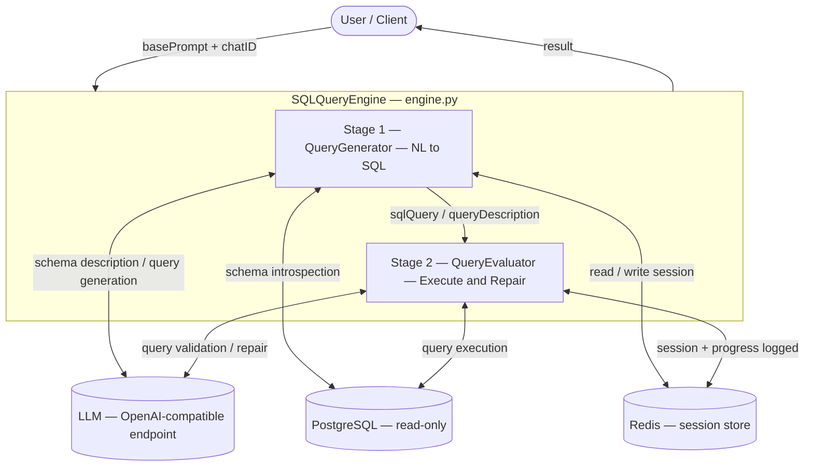
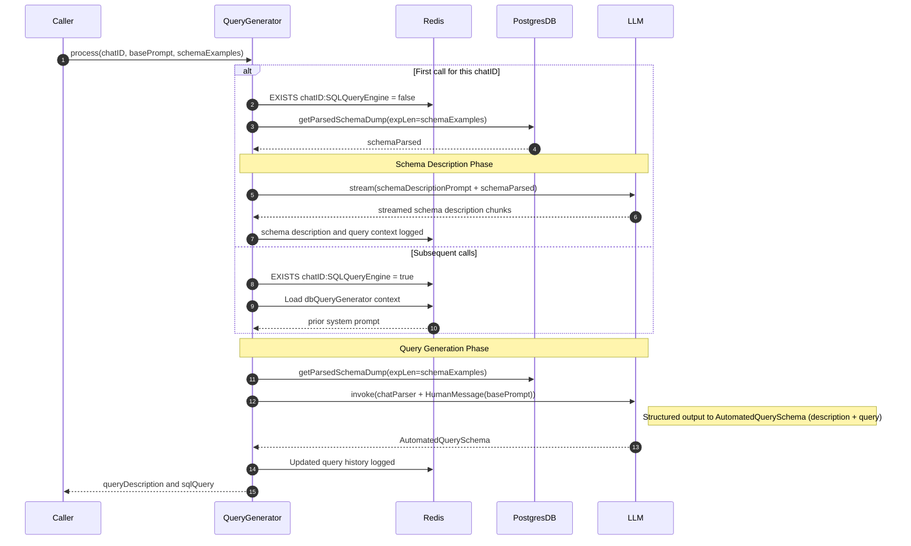
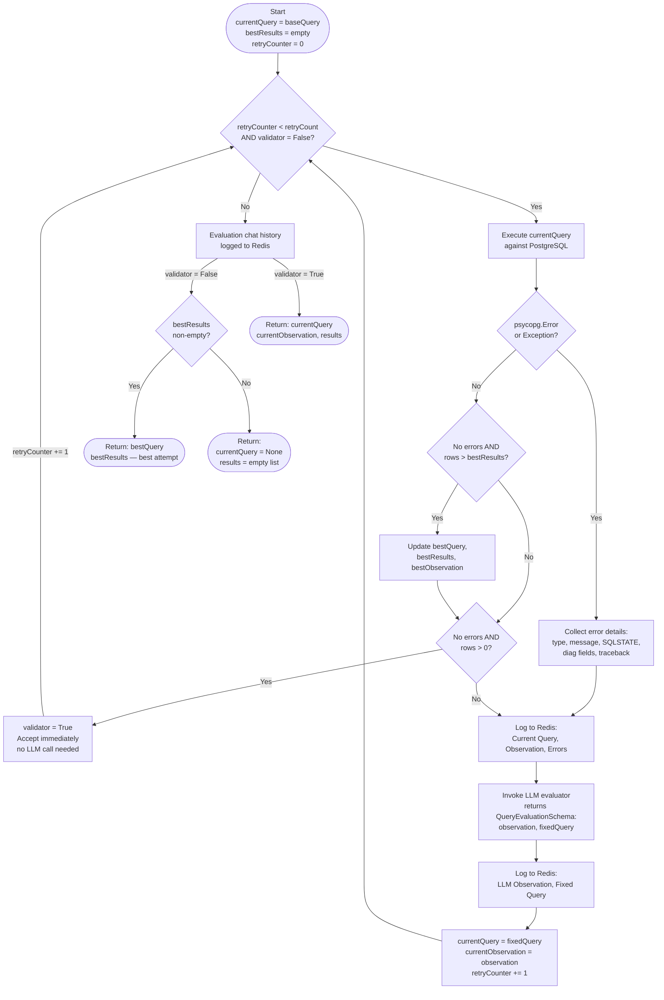
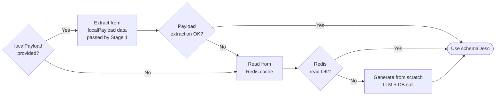
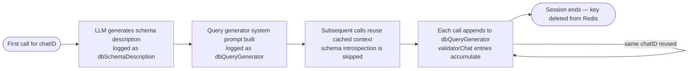
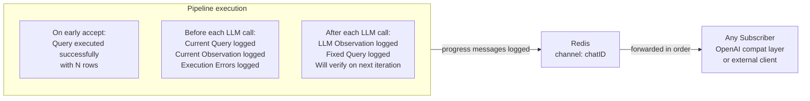
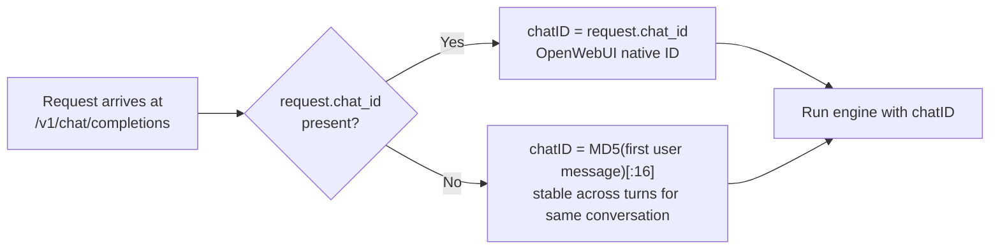
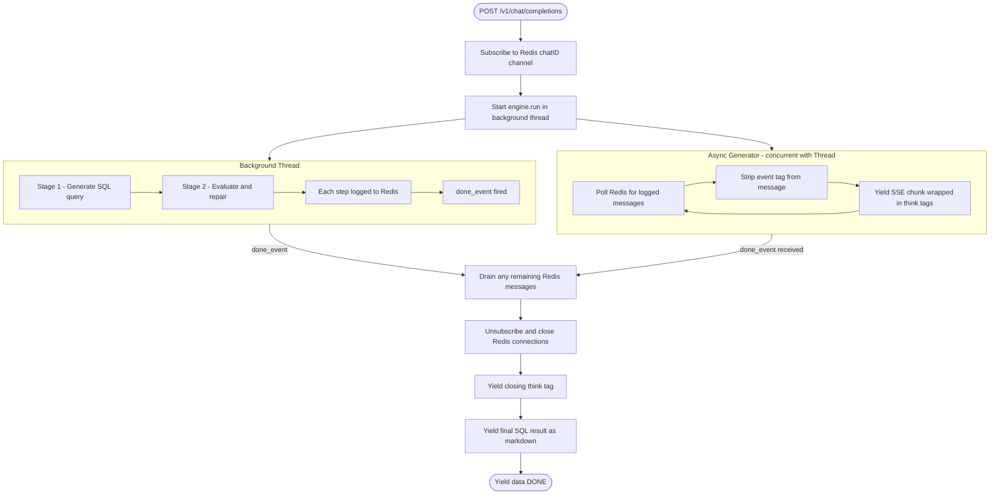

# `sqlQueryEngine` — Package Reference

This document covers the internal design, data flow, and API of the `sqlQueryEngine` Python package. It is written for contributors and integrators who want to understand how the engine works at the code level, not just how to run it.

## Table of Contents

1. [What This Package Does](#1-what-this-package-does)
2. [Module Map](#2-module-map)
3. [Core Concept: The Two-Stage Pipeline](#3-core-concept-the-two-stage-pipeline)
4. [Stage 1 — SQL Generation](#4-stage-1--sql-generation)
5. [Stage 2 — SQL Evaluation and Repair](#5-stage-2--sql-evaluation-and-repair)
6. [Schema Context Caching](#6-schema-context-caching)
7. [Redis Architecture](#7-redis-architecture)
8. [OpenAI-Compatible API Layer](#8-openai-compatible-api-layer)
9. [Streaming Architecture](#9-streaming-architecture)
10. [Supporting Modules](#10-supporting-modules)
11. [Class and Method Reference](#11-class-and-method-reference)
12. [Usage as a Python Module](#12-usage-as-a-python-module)
13. [HTTP API Reference](#13-http-api-reference)
14. [Connection Parameters Reference](#14-connection-parameters-reference)
15. [Pub/Sub Message Format Reference](#15-pubsub-message-format-reference)

## 1. What This Package Does

`sqlQueryEngine` is the core inference package. It accepts a **natural language question** and returns a **validated, executed SQL query** along with its results.

The design goal is that a user with no knowledge of database schemas should be able to ask questions in plain English and receive real data back. The engine achieves this by:

- Introspecting the connected PostgreSQL database once and summarising the schema in plain English using an LLM.
- Using that summary as context to generate a SQL query for any subsequent question.
- Executing the generated query and, if it fails or returns empty results, iteratively asking the LLM to fix it until it succeeds or the retry limit is reached.
- Publishing incremental progress to Redis Pub/Sub so any connected client can stream feedback in real time.

The entire pipeline can be used in three ways:

| Mode | What you get |
|---|---|
| **Python module** | Import `SQLQueryEngine` and call `engine.run()` directly |
| **Native HTTP API** | POST to `/inference/sqlQueryEngine/{chatID}` |
| **OpenAI-compatible API** | POST to `/v1/chat/completions` — works with OpenWebUI, any OpenAI SDK |

## 2. Module Map

```
sqlQueryEngine/
├── __init__.py          — Public exports: SQLQueryEngine, QueryGenerator, QueryEvaluator
├── main.py              — FastAPI app definition, native /inference/* routes
├── engine.py            — SQLQueryEngine: orchestrates Stage 1 + Stage 2
├── queryGenerator.py    — Stage 1: NL → SQL using LLM + schema context
├── queryEvaluator.py    — Stage 2: execute + LLM repair loop
├── dbHandler.py         — PostgreSQL read-only handler (schema introspection + query execution)
├── sessionManager.py    — Redis hash-based session store + Pub/Sub publisher
├── connConfig.py        — Environment variable loading + FastAPI query-parameter dependency
├── openaiCompat.py      — OpenAI-compatible /v1/* routes + async streaming layer
├── promptTemplates.py   — LangChain SystemMessagePromptTemplate definitions
└── sqlGuidelines.py     — PostgreSQL best-practices corpus injected into LLM prompts
```

## 3. Core Concept: The Two-Stage Pipeline



The two stages are intentionally independent — you can invoke them separately:

- **`/inference/sqlQueryGeneration/{chatID}`** runs Stage 1 only (no execution).
- **`/inference/sqlQueryEvaluation/{chatID}`** runs Stage 2 only (execute a query you already have).
- **`/inference/sqlQueryEngine/{chatID}`** runs both in sequence.

## 4. Stage 1 — SQL Generation

**File:** `queryGenerator.py` · **Class:** `QueryGenerator`

### What it does

Given a natural language `basePrompt`, Stage 1 produces a structured object with two fields:
- `queryDescription` — a plain-English description of what the query does.
- `sqlQuery` — the SQL query string (newlines collapsed to spaces).

### Internal execution sequence



### Schema description — why it matters

Raw schema dumps (column names + data types) are not always enough context for an LLM to write correct SQL. The schema description phase asks the LLM to produce a **rich human-readable document** covering:

- The purpose of each table.
- Column semantics, not just types.
- Foreign key relationships and cardinality.
- JSONB field structures inferred from sample data.
- Sample data patterns (value ranges, common strings, etc.).

This description is cached in Redis and reused on all subsequent calls for the same `chatID`, so the cost is paid only once per session.

### Response parsing

The LLM response is parsed by the static `_parseResponse()` method into an `AutomatedQuerySchema` Pydantic model containing `description`, `query`, and an optional `sql` alias. The parser uses a multi-strategy fallback chain to handle diverse LLM output formats:

1. **JSON parse** — try to parse the entire response as JSON.
2. **Embedded JSON extraction** — regex-extract a JSON object containing `query` or `sql` from surrounding text.
3. **Code block extraction** — extract SQL from `` ```sql `` or `` ``` `` fenced blocks.
4. **SELECT statement extraction** — regex-match a `SELECT … ;` statement anywhere in the response.
5. **Raw fallback** — treat the entire cleaned response as the query.

Before any strategy runs, `<think>…</think>` tags (emitted by reasoning models like Qwen) are stripped. A `model_validator` normalises the `sql` alias to `query` so both field names are accepted from any model.

## 5. Stage 2 — SQL Evaluation and Repair

**File:** `queryEvaluator.py` · **Class:** `QueryEvaluator`

### What it does

Stage 2 takes the SQL query from Stage 1 (or any externally supplied query) and runs it against PostgreSQL. If execution fails or returns no rows, it asks the LLM to diagnose and fix the query, then retries. This loop repeats up to `retryCount` times.

### The repair loop



Two key design decisions in the repair loop:

- **Early accept.** When a query executes without errors and returns rows, the loop accepts it immediately without invoking the LLM evaluator. This prevents regressions where the LLM rewrites a working query into a broken one.
- **Best-result tracking.** Every successful execution (no errors, at least one row) is compared against the best result seen so far (by row count). If retries are exhausted without the loop converging, the best result is returned rather than an empty failure.

### Schema context resolution

Before entering the repair loop, Stage 2 needs the schema description so it can explain column names to the LLM. It resolves context through a priority chain:



This means the evaluator never blocks on unavailable context — it always falls through to a working source.

### Response parsing

The LLM response is parsed by the static `_parseEvalResponse()` method into a `QueryEvaluationSchema` Pydantic model. Like the generator's parser, it uses a multi-strategy fallback chain (JSON → embedded JSON → code block → SELECT regex → raw text) and strips `<think>` tags before parsing.

`QueryEvaluationSchema` fields:

| Field | Type | Purpose |
|---|---|---|
| `isValid` | `bool` | Always `False` — the system verifies correctness by executing the query, never trusting the LLM's self-assessment |
| `modifiedUserPrompt` | `str` | Optionally adjusted user question (used as context on the next attempt) |
| `observation` | `str` | Detailed diagnosis of what was wrong |
| `fixedQuery` | `str` | Corrected SQL query |
| `fixed_query` / `sql` / `query` | `str` | Aliases for `fixedQuery` — a `model_validator` normalises whichever field the LLM returns |

The evaluator prompt instructs the LLM to **always** set `isValid=false` and provide a `fixedQuery`. The system never trusts the LLM's validity assessment — it verifies by executing the fixed query on the next loop iteration.

## 6. Schema Context Caching

Redis is the persistence layer for session state. The key structure is:

```
{chatID}:SQLQueryEngine          ← Redis Hash
    ├── dbSchemaDescription      ← JSON list of LangChain messages (system + human + assistant)
    ├── dbQueryGenerator         ← JSON list of LangChain messages (system prompt + query history)
    ├── validatorChat:1          ← Repair loop chat history from call 1
    ├── validatorChat:2          ← Repair loop chat history from call 2
    └── historyCounterManager    ← Integer: auto-incrementing counter for validatorChat keys
```



**Cache invalidation:** There is no automatic TTL. To force schema regeneration, either:
1. Change `schemaDescriptionKey` in the request body to a new string value.
2. Manually `DEL {chatID}:SQLQueryEngine` in Redis.

## 7. Redis Architecture

Redis plays two distinct roles simultaneously:

### Role 1: Hash-based session store

All conversation context (LangChain message histories) is serialised as JSON and stored in a single Redis Hash per `chatID`. The `SessionManager` class (`sessionManager.py`) handles all read/write operations.

```
HSET  {chatID}:SQLQueryEngine  <field>  <json-serialised-message-list>
HGET  {chatID}:SQLQueryEngine  <field>
HGETALL {chatID}:SQLQueryEngine
```

Messages are stored as role/content dicts:
```json
[
  {"role": "system",    "content": "You are SQLBot ..."},
  {"role": "user",      "content": "How many orders last month?"},
  {"role": "assistant", "content": "{ description: ..., query: ... }"}
]
```

### Role 2: Progress logging channel

Every significant step in the pipeline logs a message to the channel named by `chatID`. This lets any subscriber (including the OpenAI-compat streaming layer) receive live progress without polling.



## 8. OpenAI-Compatible API Layer

**File:** `openaiCompat.py`

This layer wraps the entire `SQLQueryEngine` pipeline behind the OpenAI chat completions wire format so that any client that supports OpenAI APIs (OpenWebUI, curl, LangChain, LlamaIndex, etc.) can use it without any adapter code.

### Routes

| Method | Path | Description |
|---|---|---|
| `GET` | `/v1/models` | Returns a single model entry named by `COMPLETIONS_MODEL_NAME` |
| `POST` | `/v1/chat/completions` | Chat completions (streaming SSE or single JSON) |
| `POST` | `/v1/completions` | Text completions (legacy shape) |

### Environment validation

Before executing any request, the completions routes call `_validateEnvConnParams()` which checks that all required connection environment variables (LLM, PostgreSQL, Redis) are configured. If any are missing, a `500` response is returned immediately with a clear error listing the missing variables — this surfaces configuration issues at the point of request rather than deep inside the engine.

### Pipeline defaults

The `/v1/*` routes have no query parameters for pipeline tuning. Instead, they read defaults from environment variables: `DEFAULT_RETRY_COUNT` (default `5`), `DEFAULT_SCHEMA_EXAMPLES` (default `5`), and `DEFAULT_FEEDBACK_EXAMPLES` (default `3`). These are set once and apply to all completions requests.

### Chat ID derivation

The engine needs a stable `chatID` per conversation to namespace Redis state. OpenWebUI injects a `chat_id` field into the request body extension — this is used directly when present. When absent (other clients), a stable ID is derived by MD5-hashing the **first user message**:



This design ensures that:
- OpenWebUI conversations each get their own Redis namespace automatically.
- Other clients that always start from the same question reuse cached schema context.

### Streamed response format

The final response wraps engine progress in `<think>…</think>` tags. Reasoning-aware clients like OpenWebUI collapse these into a collapsible "thinking" block, so the user sees clean SQL results in the chat bubble while the full repair loop trace is available on demand.

````
<think>
  [schema description chunks]
  [QueryFixAttempt#1: current query, errors, fixed query]
  [QueryFixAttempt#2: ...]
</think>

**Query plan:** Count orders placed in the last 30 days.

```sql
SELECT COUNT(*) FROM orders WHERE created_at >= NOW() - INTERVAL '30 days'
```

**Results** — 1 row(s) returned:

| count |
| --- |
| 842 |
````


## 9. Streaming Architecture

The OpenAI-compat streaming layer runs the synchronous `SQLQueryEngine.run()` call in a thread-pool executor while concurrently draining the Redis Pub/Sub channel as an async generator. This avoids blocking the FastAPI event loop.



Key design decisions:

- **Subscribe before starting the engine.** If the engine published messages before the subscriber connected, those messages would be lost. Subscribing first guarantees zero message loss.
- **Two Redis connections.** The `redis.asyncio` client in pub/sub mode cannot issue `PUBLISH` commands. A separate publisher connection is created to mirror content to `{chatID}:stream`.
- **Post-engine drain.** After `done_event` fires, up to 100 residual messages are drained with a 100 ms timeout to flush any in-flight publishes from the engine thread.

## 10. Supporting Modules

### `dbHandler.py` — `PostgresDB`

Wraps `psycopg3` with a read-only connection. All connections are opened with `conn.set_read_only(True)`, making it impossible for the engine to inadvertently modify data even if the LLM generates a mutating query.

Key methods:

| Method | Description |
|---|---|
| `listTables()` | Lists all tables in the `public` schema |
| `getTableSchema(table)` | Returns `(column_name, data_type)` pairs for a table |
| `getFullTableDump(table)` | Returns all rows from a table as a list of tuples |
| `getSchemaDump(expLen)` | Returns a dict of schema + sample rows per table |
| `getParsedSchemaDump(expLen)` | Returns the raw dict **and** a formatted string ready for LLM prompts |
| `queryExecutor(query)` | Executes a query, returns `list[dict]` with column names as keys; serialises `Decimal` → `float`, `datetime`/`date` → `str` |
| `close()` | Closes the cursor and connection |

### `sessionManager.py` — `SessionManager`

Manages all Redis reads and writes. All keys are namespaced as `{chatID}:{agentName}` to prevent collisions between different agents sharing the same Redis instance.

Key methods:

| Method | Description |
|---|---|
| `getUserChatContext(chatID, key)` | Reads a field, deserialises JSON → LangChain message objects |
| `postUserChatContext(chatID, key, messages)` | Serialises LangChain messages → JSON, writes to Redis |
| `getRawUserData(chatID, key)` | Raw string read |
| `postRawUserData(chatID, key, data)` | Raw JSON write |
| `updateUsageToken(chatID)` | Increments `historyCounterManager`, returns new value |

Note: `SessionManager.redisClient` is the synchronous `redis.Redis` client. The OpenAI-compat layer creates its own `redis.asyncio.Redis` connections separately for async Pub/Sub.

### `connConfig.py` — Environment loading and FastAPI dependency

Parses all environment variables at import time into three module-level dicts (`LLM_PARAMS`, `DB_PARAMS`, `REDIS_PARAMS`) and two strings (`BOT_NAME`, `SPLIT_IDENTIFIER`).

The `connectionDependency` function is a FastAPI dependency that exposes all 13 connection parameters as individual query parameters in the Swagger UI. Parameters default to the environment variable value and become required only when the environment variable is not set.

### `promptTemplates.py` — LangChain prompt definitions

Defines four `SystemMessagePromptTemplate` objects (three are actively used):

| Template | Used by | Purpose |
|---|---|---|
| `postgreSystemPrompt` | (unused — available for custom integrations) | General-purpose PostgreSQL assistant system prompt |
| `postgreSchemaDescriptionPrompt` | `QueryGenerator`, `QueryEvaluator._buildFromScratch` | Instructs the LLM to produce a comprehensive schema description document with detailed output format guidelines |
| `queryGeneratorPrompt` | `QueryGenerator` | System prompt with strict output rules (column selection, ROUND for decimals, no bind parameters, deterministic ordering), worked examples, schema description, raw schema, and PostgreSQL guidelines |
| `queryEvaluatorFixerPrompt` | `QueryEvaluator` | System prompt with strict fix rules, common fix patterns (column not found, relation not found, empty results, type mismatch), and minimum-change repair philosophy |

### `sqlGuidelines.py`

Contains two static string corpora injected into the `postgreManual` template variable:

- **`postgreManualData`** — used during generation. Covers critical output rules (column selection, numeric precision with ROUND, no bind parameters, deterministic ordering), input/output format guidelines, safety rules (SELECT-only default), SQL construction steps, common patterns (joins, CTEs, window functions, aggregates), and formatting conventions.
- **`postgreManualDataEval`** — used during evaluation. A condensed variant focused on fix rules (minimum changes, no added LIMIT, explicit casts), evaluation criteria (syntax, semantic, performance), common issues and their fixes, and rewriting guidelines that preserve original query structure.

## 11. Class and Method Reference

### `SQLQueryEngine` — `engine.py`

The public façade. Instantiate once with connection parameters, then call `run`, `generate`, or `evaluate`.

```python
SQLQueryEngine(llmParams, dbParams, redisParams, botName="SQLBot", splitIdentifier="<|-/|-/>")
```

| Method | Returns | Description |
|---|---|---|
| `run(chatID, basePrompt, retryCount, schemaExamples, feedbackExamples, schemaDescriptionKey)` | `dict` | Full two-stage pipeline |
| `generate(chatID, basePrompt, schemaExamples, schemaDescriptionKey)` | `dict` | Stage 1 only — returns `generation` dict |
| `evaluate(chatID, basePrompt, baseQuery, baseDescription, retryCount, schemaExamples, feedbackExamples, schemaDescriptionKey)` | `dict` | Stage 2 only — returns `evaluation` dict |

**Return shape for `run()`:**
```python
{
    "code": 200,
    "chatID": "user123",
    "generation": {
        "queryDescription": "Count orders placed in the last 30 days.",
        "sqlQuery": "SELECT COUNT(*) FROM orders WHERE created_at >= NOW() - INTERVAL '30 days'"
    },
    "evaluation": {
        "currentQuery": "SELECT COUNT(*) FROM orders WHERE created_at >= NOW() - INTERVAL '30 days'",
        "currentObservation": "Query executed successfully and returned 1 row.",
        "results": [{"count": "842"}]
    }
}
```

On failure, `code` is `500` and the dict contains `error: str`.

### `QueryGenerator` — `queryGenerator.py`

```python
QueryGenerator(llmParams, dbParams, redisParams, botName, agentName, splitIdentifier)
```

| Method | Returns | Description |
|---|---|---|
| `process(chatID, schemaExamples, basePrompt)` | `dict` | Full generation flow — handles session init and schema caching internally |
| `_parseResponse(content)` | `AutomatedQuerySchema` | (static) Multi-strategy parser: JSON → embedded JSON → code block → SELECT regex → raw text |

### `QueryEvaluator` — `queryEvaluator.py`

```python
QueryEvaluator(llmParams, dbParams, redisParams, botName, agentName, splitIdentifier)
```

| Method | Returns | Description |
|---|---|---|
| `process(chatID, basePrompt, baseQuery, baseDescription, retryCount, generatorContextKey, schemaExamples, feedbackExamples, localPayload, hardLimit)` | `dict` | Full evaluation + repair loop |
| `_parseEvalResponse(content)` | `QueryEvaluationSchema` | (static) Multi-strategy parser — same fallback chain as `_parseResponse` |
| `_buildFromPayload(generatorContextKey, localPayload)` | `dict` | (internal) Extracts schema context from a prior `QueryGenerator` response |
| `_buildFromRedis(chatID, generatorContextKey)` | `dict` | (internal) Reads cached schema context from Redis |
| `_buildFromScratch(chatID, generatorContextKey, schemaExamples)` | `dict` | (internal) Generates schema context fresh from DB + LLM |


## 12. Usage as a Python Module

Install the package dependencies and import `SQLQueryEngine` directly — no HTTP server required.

```python
from sqlQueryEngine import SQLQueryEngine

engine = SQLQueryEngine(
    llmParams={
        "model":       "qwen2.5-coder:7b",
        "temperature": 0.1,
        "base_url":    "http://localhost:11434/v1",
        "api_key":     "ollama"
    },
    dbParams={
        "host":     "localhost",
        "port":     5432,
        "dbname":   "mydb",
        "user":     "postgres",
        "password": "secret"
    },
    redisParams={
        "host":             "localhost",
        "port":             6379,
        "password":         "",
        "db":               0,
        "decode_responses": True
    }
)

# Full pipeline
result = engine.run(
    chatID="session-42",
    basePrompt="How many orders were placed last month?",
    retryCount=5,
    schemaExamples=5,
    feedbackExamples=3
)

print(result["generation"]["sqlQuery"])
# SELECT COUNT(*) FROM orders WHERE DATE_TRUNC('month', created_at) = DATE_TRUNC('month', NOW() - INTERVAL '1 month')

print(result["evaluation"]["results"])
# [{"count": "1284"}]
```

```python
# Stage 1 only — get SQL without executing it
gen = engine.generate(chatID="session-42", basePrompt="List all customers from Germany")
print(gen["generation"]["sqlQuery"])

# Stage 2 only — execute and repair a query you already have
eval_result = engine.evaluate(
    chatID="session-42",
    basePrompt="List all customers from Germany",
    baseQuery="SELECT * FROM customer WHERE country = 'Germany' LIMIT 100",
    baseDescription="Select all German customers",
    retryCount=3
)
print(eval_result["evaluation"]["results"])
```

**The `chatID` parameter is your scoping key.** Reuse it across calls to share the cached schema context. Use a fresh one to start a new session with no prior context.

## 13. HTTP API Reference

All routes are documented interactively at `http://localhost:5181/docs`.

### Native inference routes

#### `POST /inference/sqlQueryEngine/{chatID}`

Full two-stage pipeline.

**Path param:**
- `chatID` — session identifier, used as Redis namespace.

**Request body:**
```json
{
  "basePrompt": "How many orders were placed in the last 30 days?",
  "retryCount": 5,
  "schemaExamples": 5,
  "feedbackExamples": 3,
  "schemaDescriptionKey": "dbSchemaDescription",
  "extraPayload": null
}
```

**Response `200`:**
```json
{
  "code": 200,
  "status": "...",
  "chatID": "session-42",
  "agentResponse": {
    "generation": { "queryDescription": "...", "sqlQuery": "..." },
    "evaluation": { "currentQuery": "...", "currentObservation": "...", "results": [...] }
  },
  "extraPayload": null
}
```

#### `POST /inference/sqlQueryGeneration/{chatID}`

Stage 1 only. Same body as above minus `retryCount` and `feedbackExamples`.

#### `POST /inference/sqlQueryEvaluation/{chatID}`

Stage 2 only. Requires `baseQuery` and `baseDescription` in the body.

#### `GET /ping`

Health check. Returns `200` with host, port, and client metadata.

### OpenAI-compatible routes

#### `GET /v1/models`
```json
{
  "object": "list",
  "data": [{ "id": "SQLBot", "object": "model", "owned_by": "sql-query-engine" }]
}
```

#### `POST /v1/chat/completions`

Accepts a standard OpenAI chat completions body. The `model` field is ignored; the SQL engine is always used. `stream=true` (default) returns an SSE stream; `stream=false` returns a single JSON object.

```json
{
  "model": "SQLBot",
  "messages": [
    { "role": "user", "content": "How many active users are there?" }
  ],
  "stream": true,
  "chat_id": "openwebui-chat-uuid-here"
}
```

#### `POST /v1/completions`

Text completions variant. Accepts a single `prompt` string. Returns the legacy `text_completion` response shape.

**Authentication:** When `OPENAI_API_KEY` is set, all `/v1/*` routes require `Authorization: Bearer <key>`. Multiple keys are comma-separated in the environment variable.

## 14. Connection Parameters Reference

All parameters can be set as environment variables (for production) **or** overridden per-request as query parameters on the `/inference/*` routes (for development/multi-tenant use).

### LLM

| Env var | Query param | Default | Description |
|---|---|---|---|
| `LLM_BASE_URL` | `llmBaseURL` | `""` | OpenAI-compatible API base URL (e.g. `http://host:11434/v1`) |
| `LLM_MODEL` | `llmModel` | `""` | Model identifier (e.g. `qwen2.5-coder:7b`) |
| `LLM_API_KEY` | `llmAPIKey` | `""` | Bearer token for the LLM endpoint |
| `LLM_TEMPERATURE` | `llmTemperature` | `None` | Sampling temperature (`0.0`–`1.0`) |

### PostgreSQL

| Env var | Query param | Default | Description |
|---|---|---|---|
| `POSTGRES_HOST` | `postgreHost` | `""` | Database host |
| `POSTGRES_PORT` | `postgrePort` | `None` | Database port |
| `POSTGRES_DB` | `postgreDBName` | `""` | Database name |
| `POSTGRES_USER` | `postgreUser` | `""` | Database user |
| `POSTGRES_PASSWORD` | `postgrePassword` | `None` | Database password |

### Redis

| Env var | Query param | Default | Description |
|---|---|---|---|
| `REDIS_HOST` | `redisHost` | `""` | Redis host |
| `REDIS_PORT` | `redisPort` | `None` | Redis port |
| `REDIS_PASSWORD` | `redisPassword` | `None` | Redis password |
| `REDIS_DB` | `redisDB` | `None` | Redis logical DB number |

### Pipeline defaults (OpenAI compat routes only)

| Env var | Default | Description |
|---|---|---|
| `DEFAULT_RETRY_COUNT` | `5` | Max repair attempts per request |
| `DEFAULT_SCHEMA_EXAMPLES` | `5` | Sample rows per table in schema context |
| `DEFAULT_FEEDBACK_EXAMPLES` | `3` | Result rows fed back to LLM evaluator |

### Bot identity

| Env var | Default | Description |
|---|---|---|
| `BOT_NAME` | `SQLBot` | Display name for the assistant in all prompts |
| `COMPLETIONS_MODEL_NAME` | value of `BOT_NAME` | Model name returned by `/v1/models` and echoed in responses |
| `OPENAI_API_KEY` | `""` (auth disabled) | Comma-separated Bearer tokens for `/v1/*` routes |
| `SPLIT_IDENTIFIER` | `<\|-/\|-/>` | Delimiter in Redis Pub/Sub messages (separates event tag from content) |

## 15. Pub/Sub Message Format Reference

Every message published to `{chatID}` follows this format:

```
</{component}:{event}>{SPLIT_IDENTIFIER}{content}
```

`SPLIT_IDENTIFIER` defaults to `<|-/|-/>`. Content after the identifier is what gets displayed to the user.

### Messages published during Stage 1 (schema generation)

| Component | Event | Content |
|---|---|---|
| `SQLQueryGenerator` | `schemaDescriptionChat` | Streamed chunk of the schema description LLM response |

### Messages published during Stage 2 (repair loop)

**On early accept** (query executed successfully with rows — no LLM call):

| Component | Event | Content |
|---|---|---|
| `SQLQueryEvaluator` | `QueryFixAttempt#N` | `Query executed successfully with {rowCount} rows` |

**Before each LLM call** (query failed or returned empty):

| Component | Event | Content |
|---|---|---|
| `SQLQueryEvaluator` | `QueryFixAttempt#N` | `Current Query : {sql}` |
| `SQLQueryEvaluator` | `QueryFixAttempt#N` | `Current Observation : {text}` |
| `SQLQueryEvaluator` | `QueryFixAttempt#N` | `Execution Errors : {error or "No errors encountered."}` |

**After each LLM call** (repair visibility):

| Component | Event | Content |
|---|---|---|
| `SQLQueryEvaluator` | `QueryFixAttempt#N` | `LLM Observation : {text}` |
| `SQLQueryEvaluator` | `QueryFixAttempt#N` | `Fixed Query : {sql}` |
| `SQLQueryEvaluator` | `QueryFixAttempt#N` | `Will verify fixed query on next iteration` |

The schema description during Stage 2 `_buildFromScratch`:

| Component | Event |
|---|---|
| `SQLQueryEvaluator` | `schemaDescriptionChat` |

### Mirror channel

The OpenAI-compat streaming layer additionally publishes cleaned content (event tag stripped) to `{chatID}:stream`, so external pub/sub subscribers receive the same content without needing an SSE connection.
